# Solução de Pipeline CI/CD com GitHub Actions (Para Desafio Técnico)

Este documento apresenta uma solução completa de pipeline CI/CD usando GitHub Actions para o projeto de aplicação web "Crônicas App", atendendo a todos os requisitos especificados no desafio.
.

Link para aplicação online na plataforma Cloudflare: [Cronicas APP](https://cronicas-app.pages.dev/).

## Índice

- [Requisitos Atendidos](#requisitos-atendidos)
- [Estrutura do Pipeline](#estrutura-do-pipeline)
- [Workflow de CI/CD](#workflow-de-cicd)
- [Configuração de Ambientes e Aprovações](#configuração-de-ambientes-e-aprovações)
- [Notificações de Falha](#notificações-de-falha)
- [Action Personalizada em TypeScript](#action-personalizada-em-typescript)
- [Arquitetura do Pipeline](#arquitetura-do-pipeline)
- [Implementação](#implementação)

## Requisitos Atendidos

✅ Pipeline ativado com commits na branch main  
✅ Instalação de dependências  
✅ Execução de testes unitários  
✅ Build da aplicação  
✅ Armazenamento de artefatos como release do GitHub  
✅ Uso de environments para aprovação de deploy  
✅ Deploy em ambiente de produção após sucesso  
✅ Notificação por e-mail em caso de falha  

### Funcionalidades Adicionais (Plus)

✅ Desenho de arquitetura com separação clara entre CI e CD  
✅ Action personalizada em TypeScript para quality gates
✅ Workflow para criação de PR automaticamente para main
✅ Arquivo CODEOWNERS para review em branchs bloqueadas

## Estrutura do Pipeline

O pipeline foi estruturado com os respectivos temas:

1. **Integração Contínua (CI)**: Validação da qualidade do código e build
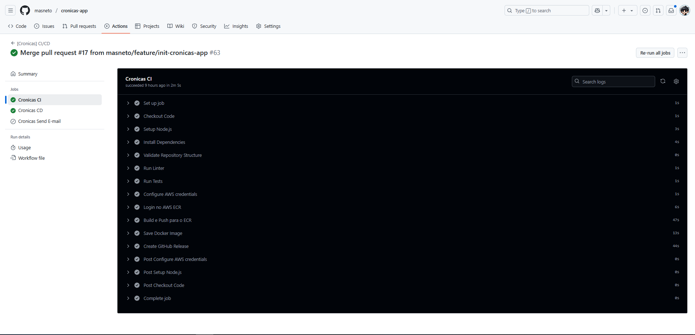
2. **Entrega Contínua (CD)**: Deploy do conteiner
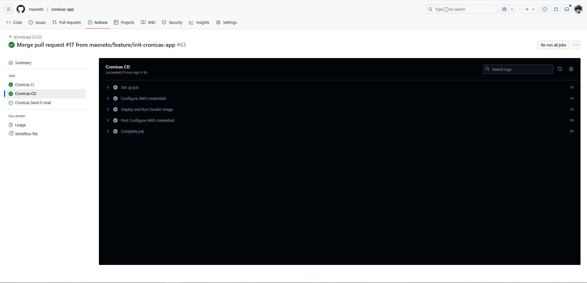
3. **CI Action(s)**: Validação do código das Actions internas
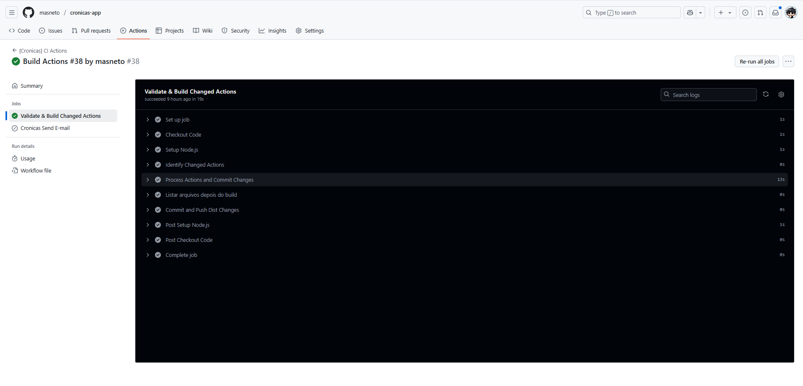
4. **Criação de Pull Request automatizado**: PRs criados a partir de branchs feature/* 
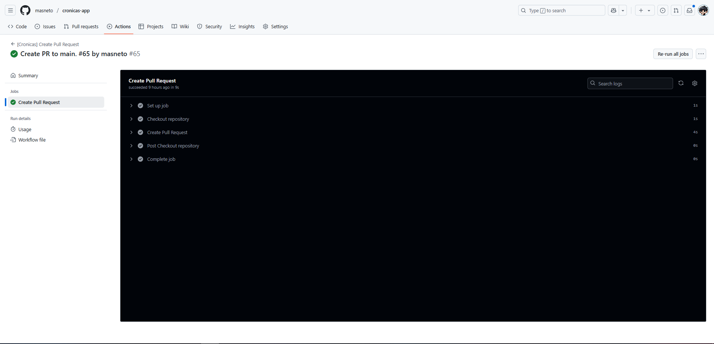

## Workflow de CI/CD

Arquivo: `.github/workflows-backup/ci-cd-aws.yml`

## Configuração de Ambientes e Aprovações

Para atender ao requisito de restrição de aprovação do deploy, configuramos um ambiente GitHub chamado "production" que requer aprovação manual:

1. No repositório GitHub, vá para **Settings > Environments**
2. Crie um ambiente chamado "production"
3. Configure as regras de proteção:
   - Marque "Required reviewers"
   - Adicione os usuários como revisores necessários
   - Configure o "Deployment branch pattern" para `main`

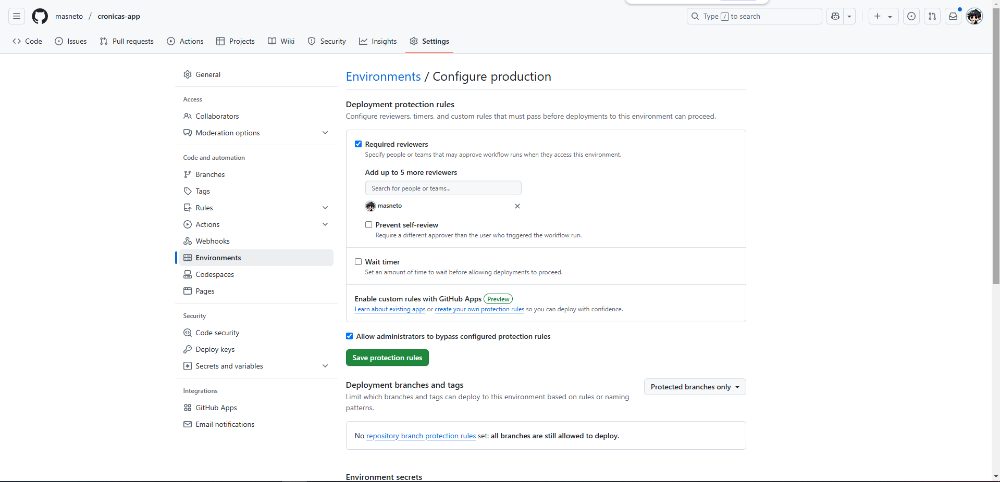

## Notificações de Falha

Adicionado uma step no workflow de CI/CD para notificações de falha:

Arquivo: `.github/workflows/ci-cd.yml#L100`

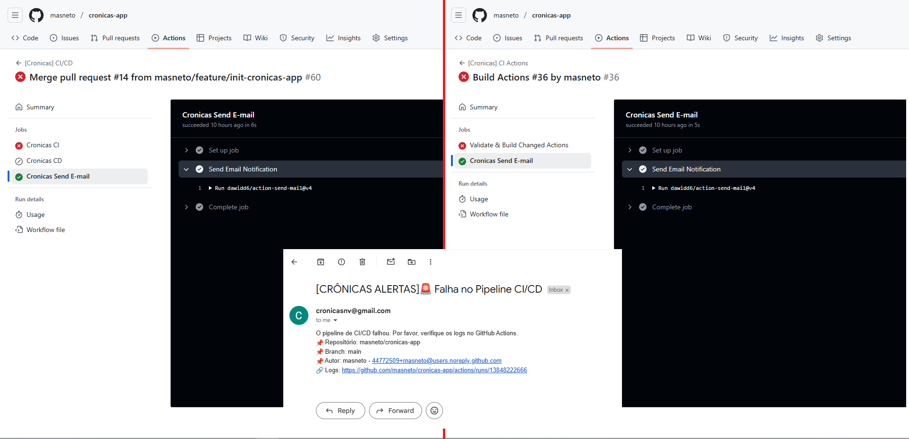

## Action Personalizada em TypeScript

Para atender ao requisito adicional, criamos uma Action personalizada em TypeScript para validar a estrutura do repositório:

Arquivo: `.github/actions/validate-repo/action.yml`
Arquivo: `.github/actions/validate-repo/src/index.ts`
Arquivo: `.github/actions/validate-repo/package.json`

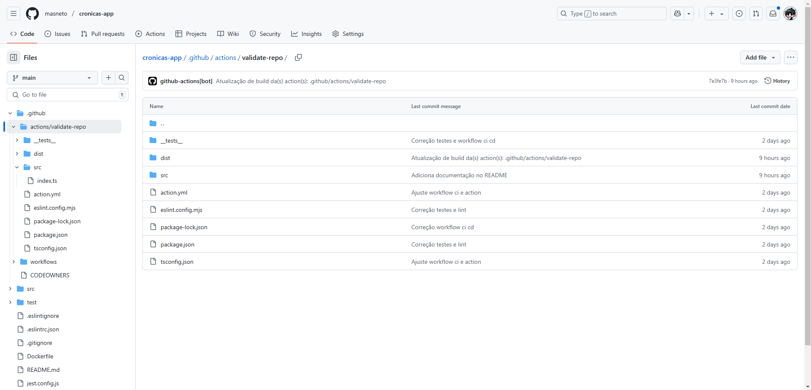

## Arquitetura do Pipeline

Abaixo está o diagrama da arquitetura do pipeline CI/CD, mostrando claramente a separação entre as etapas de CI e CD, bem como os pontos de interação manual:

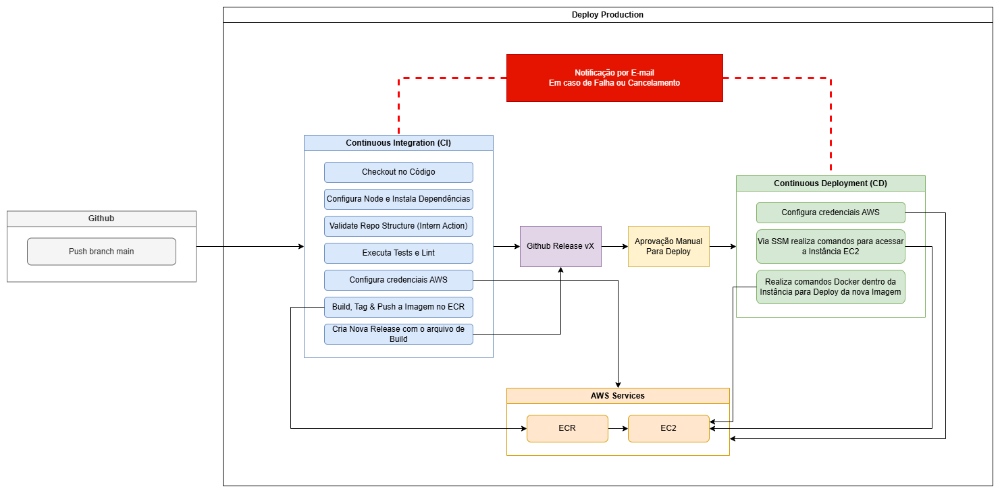

### Explicação do Fluxo:

1. **Fase de CI (Automática)**:
   - Checkout do código
   - Setup do ambiente Node.js
   - Instalação de dependências
   - Validação da estrutura do repositório (Action personalizada)
   - Execução de linting
   - Execução de testes unitários
   - Build, tag e push da imagem Docker para ECR

2. **Ponte CI/CD**:
   - Criação da release no GitHub com os artefatos

3. **Fase de CD (Requer Aprovação)**:
   - Aprovação manual por usuários autorizados
   - Deploy na instância EC2 de 'production'

4. **Notificações**:
   - Envio de e-mail em caso de falha em qualquer etapa

## Implementação

Para implementar esta solução:

1. Crie os diretórios e arquivos conforme estrutura apresentada
2. Configure os secrets necessários no repositório GitHub:
   - `AWS_ACCESS_KEY_ID` e `AWS_SECRET_ACCESS_KEY`
   - `AWS_ACCOUNT_ID`, `EC2_INSTANCE_ID` e `EC2_PUBLIC_IP`
   - `EC2_SSH_KEY` e `MAIL_PASSWORD`
   - `MAIL_USERNAME` e `PAT_GITHUB_TOKEN`

   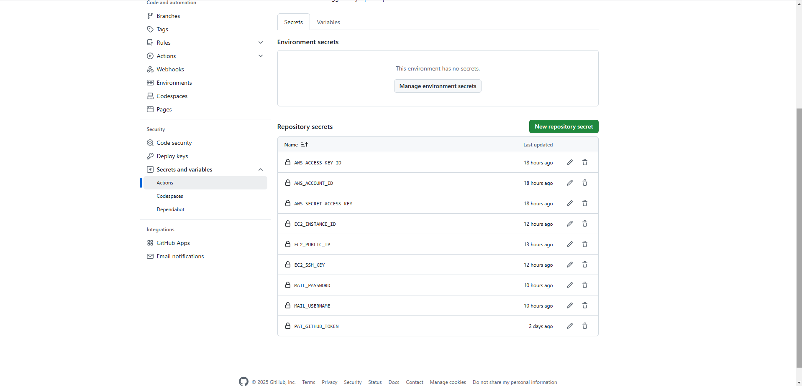

3. Configure o ambiente "production" com as restrições de aprovação
4. Configure a infraestrutura na AWS com o ECR e EC2
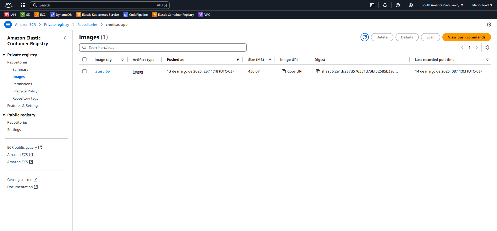
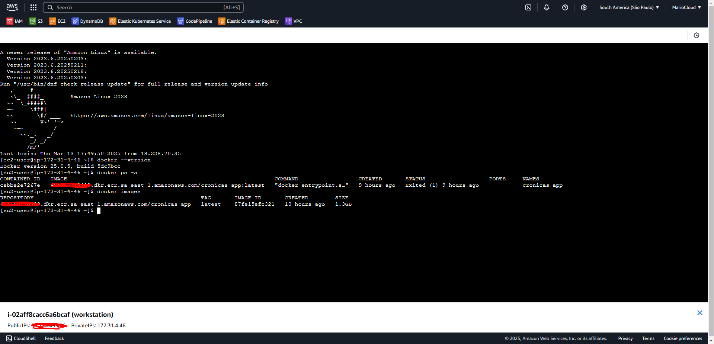
5. Faça um commit na branch main para acionar o pipeline
6. (Opcional) Faça commit em uma branch criada a partir da main para criar um fluxo que permitirá deixar a main mais protegida.

### Recursos necessários:

- Repositório GitHub para o Crônicas App
- Conta AWS com serviços ECR e EC2 configurados
- Instância EC2 para ambiente de 'production'
- Credenciais SMTP para envio de e-mails (No teste foi utilizado o GMAIL)
