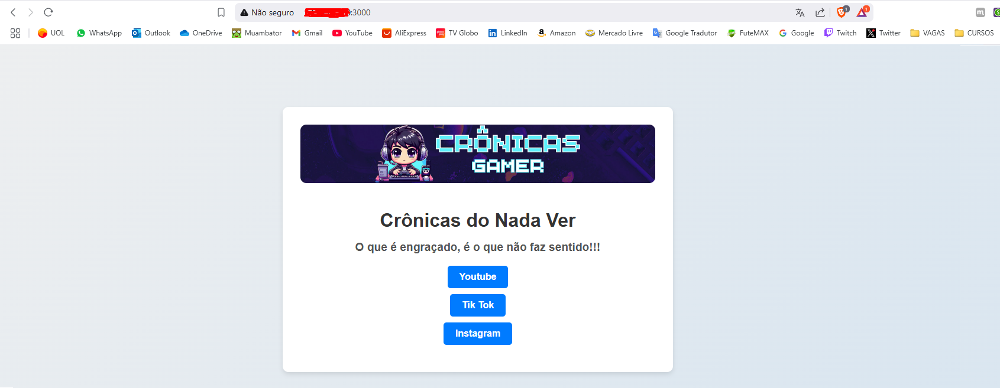

# Documentação do Projeto: Crônicas App

## Índice

- [Descrição do Projeto](#descrição-do-projeto)
- [Estrutura do Projeto](#estrutura-do-projeto)
- [Passo a Passo do Workflow de Criação de Pull Request (`create-pr.yml`)](#passo-a-passo-do-workflow-de-criação-de-pull-request-create-pryml)
- [Passo a Passo do Workflow de CI/CD de Desenvolvimento (`dev-ci-cd.yml`)](#passo-a-passo-do-workflow-de-cicd-de-desenvolvimento-dev-ci-cdyml)
- [Passo a Passo do Workflow de CD de Homologação (`hom-cd.yml`)](#passo-a-passo-do-workflow-de-cd-de-homologação-hom-cdyml)
- [Passo a Passo do Workflow de CD de Produção (`prod-cd.yml`)](#passo-a-passo-do-workflow-de-cd-de-produção-prod-cdyml)
- [Passo a Passo do Workflow de Release (`release.yml`)](#passo-a-passo-do-workflow-de-release-releaseyml)
- [Passo a Passo do Workflow de Segurança (`security-audit.yml`)](#passo-a-passo-do-workflow-de-segurança-security-audityml)
- [Passo a Passo do Workflow de Playlist (`update-playlist.yml`)](#passo-a-passo-do-workflow-de-playlist-update-playlistyml)
- [Como Executar Localmente](#como-executar-localmente)
- [Build Manual with Docker](#build-manual-with-docker)
- [Responsáveis por Aprovações](#responsáveis-por-aprovações)
- [Tecnologias Utilizadas](#tecnologias-utilizadas)
- [Melhorias Futuras](#melhorias-futuras)

## Descrição do Projeto
O Crônicas App é uma aplicação web que centraliza conteúdos do projeto "Crônicas do Nada Ver". A aplicação exibe informações, links para redes sociais e outros conteúdos relacionados. O projeto utiliza uma arquitetura moderna com integração contínua (CI) e entrega contínua (CD) para garantir qualidade e automação no desenvolvimento e deploy.

Link para aplicação online na plataforma Cloudflare: [Cronicas APP](https://cronicas-app.pages.dev/).


---

## Estrutura do Projeto

```
cronicas-app/
├── .dockerignore              # Ignora arquivos para build Docker
├── .eslintignore              # Ignora arquivos para o ESLint
├── .eslintrc.json             # Configuração do ESLint
├── .gitignore                 # Ignora arquivos para o Git
├── DESAFIO.md                 # Desafio proposto/documentação extra
├── Dockerfile                 # Configuração para criar a imagem Docker
├── eslint.config.js           # Configuração adicional do ESLint
├── package.json               # Gerenciamento de dependências e scripts
├── README.md                  # Documentação do projeto
├── SECURITY_FIXES.md          # Changelog de correções de segurança (automático)
├── images/                    # Imagens utilizadas na documentação do Desafio
│   ├── cronicas-0.png
│   ├── cronicas-1.png
│   ├── cronicas-2.png
│   ├── cronicas-3.png
│   ├── cronicas-4.png
│   ├── cronicas-5.png
│   ├── cronicas-6.png
│   ├── cronicas-7.png
│   ├── cronicas-8.png
│   ├── cronicas-9.png
│   ├── cronicas-arquitetura.png
│   └── cronicas-env-config.png
├── k8s/                       # Configurações de deploy para Kubernetes
│   ├── dev/
│   │   ├── deployment.yaml
│   │   └── service.yaml
│   ├── hom/
│   │   ├── deployment.yaml
│   │   └── service.yaml
│   └── prod/
│       ├── deployment.yaml
│       └── service.yaml
├── src/                       # Código-fonte da aplicação
│   ├── app.js                 # Lógica principal da aplicação
│   ├── server.js              # Configuração do servidor Express
│   └── public/                # Arquivos públicos (HTML, CSS)
│       ├── index.html         # Página inicial
│       └── styles.css         # Estilos da aplicação
└── .github/                   # Configurações e automações do GitHub
    ├── CODEOWNERS             # Responsáveis por aprovações de PR
    ├── files-backup/          # Backups de arquivos de workflow
    │   ├── ci-actions.yml
    │   ├── ci-cd-aws.yml
    │   ├── notify-failure.yml
    └── workflows/             # Workflows de CI/CD
        ├── create-pr.yml
        ├── dev-ci-cd.yml
        ├── hom-cd.yml
        ├── prod-cd.yml
        ├── release.yml
        └── security-audit.yml
```
---

## Passo a Passo do Workflow de Criação de Pull Request (`create-pr.yml`)

Este workflow automatiza a criação de Pull Requests de branches `feature/*` para a branch `develop`.

### Quando é disparado?
- Sempre que houver um push em qualquer branch que siga o padrão `feature/*`.

### Etapas do Workflow

1. **Checkout do Repositório**
   - Faz o checkout do código da branch `feature/*` que recebeu o push.

2. **Criação do Pull Request**
   - Usa a action `peter-evans/create-pull-request` para criar automaticamente um Pull Request da branch atual (`feature/*`) para a branch `develop`.
   - O título e o corpo do PR são preenchidos automaticamente.
   - O PR não é criado como rascunho (`draft: false`).

3. **Notificação de Falha**
   - Se algum passo falhar, executa um job que:
     - Identifica o job com falha.
     - Envia um e-mail de alerta para os responsáveis, com detalhes do erro.

---

## Passo a Passo do Workflow de CI/CD de Desenvolvimento (`dev-ci-cd.yml`)

Este workflow automatiza o processo de integração e entrega contínua para o ambiente de desenvolvimento do Crônicas App. Ele é disparado **quando um Pull Request para a branch `develop` é fechado e mergeado**.

### 1. Bump de Versão
- **Ação:** Usa a action `mathieudutour/github-tag-action` para calcular a próxima versão do projeto (sem criar o tag de fato, pois está em `dry_run`).
- **Saída:** A nova versão é salva para ser usada nos próximos jobs.

### 2. Integração Contínua (CI)
- **Checkout do Código:** Baixa o código do repositório.
- **Setup do Node.js:** Prepara o ambiente Node.js na versão 20.
- **Instala Dependências:** Executa `npm ci` para instalar as dependências.
- **Valida Estrutura do Repositório:** Usa a action interna `validate-repo` para garantir que a estrutura está correta.
- **Lint:** Executa o linter (`npm run lint`) para padronização do código.
- **Login no GHCR:** Faz login no GitHub Container Registry usando o token do GitHub.
- **Build e Push da Imagem:** 
  - Constrói a imagem Docker com a nova versão e também com a tag `latest`.
  - Faz push das duas tags para o GHCR.

### 3. Entrega Contínua (CD)
- **Configura Credenciais AWS:** Usa as credenciais do GitHub Secrets para acessar a AWS.
- **Deploy via AWS SSM:** 
  - Envia comandos para a instância EC2 de desenvolvimento via SSM para:
    - Fazer login no GHCR.
    - Baixar a imagem Docker da nova versão.
    - Parar e remover o container antigo.
    - Subir o novo container com a imagem atualizada.

### 4. Criação de Pull Request para Release
- **Checkout do Código:** Baixa o código da branch `main`.
- **Cria Branch de Release:** Cria uma nova branch `release/vX.Y.Z` baseada na versão calculada.
- **Cria Pull Request:** Abre um PR automaticamente de `develop` para `release/vX.Y.Z` para iniciar o fluxo de homologação.

### 5. Notificação de Falha
- **Detecção de Falha:** Se qualquer job falhar, executa este job.
- **Envia E-mail:** Usa uma action personalizada para enviar um e-mail de alerta com detalhes do erro para os responsáveis.

---

## Passo a Passo do Workflow de CD de Homologação (`hom-cd.yml`)

Este workflow automatiza o deploy do Crônicas App no ambiente de homologação. Ele é disparado **quando um Pull Request para uma branch `release/v*` é fechado e mergeado**.

### 1. Criação de Tag de Versão
- **Ação:** Usa a action `mathieudutour/github-tag-action` para criar uma nova tag de versão baseada na branch `release/v*`.
- **Saída:** A nova versão é salva para ser usada nos próximos jobs.

### 2. Deploy na EC2 de Homologação (CD)
- **Checkout do Código:** Baixa o código do repositório.
- **Login no GHCR:** Faz login no GitHub Container Registry usando o token do GitHub.
- **Configura Credenciais AWS:** Usa as credenciais do GitHub Secrets para acessar a AWS.
- **Deploy via AWS SSM:** 
  - Envia comandos para a instância EC2 de homologação via SSM para:
    - Fazer login no GHCR.
    - Baixar a imagem Docker da nova versão.
    - Parar e remover o container antigo.
    - Subir o novo container com a imagem atualizada.

### 3. Criação de Pull Request para Produção
- **Checkout do Código:** Baixa o código do repositório.
- **Cria Pull Request:** Abre um PR automaticamente de `release/vX.Y.Z` para `main` para iniciar o fluxo de produção.

### 4. Notificação de Falha
- **Detecção de Falha:** Se qualquer job falhar, executa este job.
- **Envia E-mail:** Usa uma action personalizada para enviar um e-mail de alerta com detalhes do erro para os responsáveis.

---

## Passo a Passo do Workflow de CD de Produção (`prod-cd.yml`)

Este workflow automatiza o deploy do Crônicas App no ambiente de produção. Ele é disparado **quando um Pull Request para a branch `main` é editado** e o nome da branch de origem contém `release/v`.

### 1. Deploy na EC2 de Produção (CD)
- **Login no GHCR:** Faz login no GitHub Container Registry usando o token do GitHub.
- **Configura Credenciais AWS:** Usa as credenciais do GitHub Secrets para acessar a AWS.
- **Deploy via AWS SSM:** 
  - Envia comandos para a instância EC2 de produção via SSM para:
    - Fazer login no GHCR.
    - Baixar a imagem Docker da versão release.
    - Parar e remover o container antigo.
    - Subir o novo container com a imagem atualizada.

### 2. Notificação de Falha
- **Detecção de Falha:** Se o job de deploy falhar, executa este job.
- **Envia E-mail:** Usa uma action personalizada para enviar um e-mail de alerta com detalhes do erro para os responsáveis.

---

## Passo a Passo do Workflow de Release (`release.yml`)

Este workflow automatiza a criação de uma release no GitHub e o upload da imagem Docker correspondente. Ele é disparado **quando um Pull Request para a branch `main` é fechado e mergeado**.

### Etapas do Workflow

1. **Checkout do Código**
   - Faz o checkout do repositório para obter o código-fonte.

2. **Obter Versão**
   - Extrai a versão a partir do nome da branch de origem (`release/vX.Y.Z`).

3. **Login no GHCR**
   - Faz login no GitHub Container Registry usando o token do GitHub.

4. **Salvar Imagem Docker**
   - Baixa a imagem Docker da versão correspondente do GHCR.
   - Salva a imagem em um arquivo `.tar`.

5. **Criar Release no GitHub**
   - Cria uma release no GitHub com a tag `vX.Y.Z`.
   - Anexa o arquivo da imagem Docker à release.

6. **Notificação de Falha**
   - Se algum passo falhar, executa um job que:
     - Identifica o job com falha.
     - Envia um e-mail de alerta para os responsáveis, com detalhes do erro.

---

## Passo a Passo do Workflow de Segurança (`security-audit.yml`)

Este workflow automatiza a auditoria de segurança das dependências npm do Crônicas App. Ele é disparado **diariamente (02:00 UTC)**, **a cada push na branch `main`** (ignorando alterações em `.github/workflows/**`) ou **manualmente** (`workflow_dispatch`).

### Etapas do Workflow

1. **Checkout do Código**
   - Baixa o repositório com histórico completo (`fetch-depth: 0`) para permitir a detecção de mudanças.

2. **Setup do Node.js**
   - Prepara o ambiente Node.js na versão 22 com cache do npm baseado no `package-lock.json`.

3. **Auditoria e Correção**
   - Usa a action compartilhada `masneto/cronicas-actions` (`npm-security-audit`) para:
     - Executar `npm audit` considerando **todas as severidades** (info, low, moderate, high, critical).
     - Aplicar correções automáticas (`npm audit fix --force`) e, quando necessário, atualizar pins em `overrides` (`fixOverridePins`) e aplicar fallbacks.
     - Expor outputs como `had-vulnerabilities`, `before`, `after` e `changelog-entries`.

4. **Atualização do Changelog de Segurança**
   - Se houver vulnerabilidades, registra as correções no arquivo `SECURITY_FIXES.md` (modo `changelog-only`), incluindo pacote, severidade, range afetado, correção disponível e link do pipeline.

5. **Verificação de Mudanças**
   - Detecta se a correção gerou alterações no repositório (`git diff`).

6. **Criação de Pull Request**
   - Se houver correções, cria automaticamente um PR de `security/npm-audit-fixes` para `main` com:
     - Título `Security: npm audit fixes (<run_id>)` e commit `fix(security): npm audit fixes`.
     - Labels `security`, `dependencies` e `automated`.
     - Revisor definido como `masneto`.

7. **Merge do Pull Request**
   - Se o PR foi criado, faz o merge automático via API do GitHub com `merge_method: squash`.

---

## Passo a Passo do Workflow de Playlist (`update-playlist.yml`)

Este workflow gerencia as músicas da playlist do site, editando diretamente o array `songs` em `src/public/index.html` e enviando a alteração para a branch `main` (a aplicação pública é servida pelo Cloudflare Pages a partir de `src/public`). Ele é disparado **manualmente** (`workflow_dispatch`).

### Como usar

1. **Adicionar música(s)**
   - `link`: link do Suno (`https://suno.com/embed/<uuid>`) ou apenas o UUID da música. Para adicionar **várias de uma vez**, separe cada link/UUID por vírgula ou quebra de linha.
   - `music-name`: nome da música (ex.: `Eclipse Lunar`). **Opcional** — se deixado em branco, o workflow busca o nome automaticamente na Suno a partir do link. Quando há vários links, esse campo é ignorado (os títulos são todos buscados na Suno).
   - A playlist passa a exibir `N - Eclipse Lunar`.

2. **Remover música**
   - `music-number`: número atual da música a remover
   - As músicas seguintes são renumeradas automaticamente.

3. **Adicionar e remover na mesma execução**
   - Preencha `link` (e opcionalmente `music-name`) **e** `music-number` juntos: a remoção é aplicada primeiro (pela numeração atual) e depois a música é adicionada ao final.

### Etapas do Workflow

1. **Checkout do Código**
   - Baixa o repositório na branch `main`.

2. **Setup do Node.js**
   - Prepara o ambiente Node.js na versão 24.

3. **Atualizar músicas**
   - Executa `node .github/scripts/update-playlist.mjs` com as entradas informadas, validando os UUIDs, impedindo duplicidades e reescrevendo o array `songs`. Links inválidos são ignorados com um aviso. Se `music-name` estiver vazio, o script consulta a Suno automaticamente para descobrir o título de cada música (formato `NOME by ARTISTA` da tag `<title>`).

4. **Commit e push**
   - Cria o commit (`playlist: adicionar <nome>`, `playlist: remover música #N` ou `playlist: atualizar músicas` quando faz as duas coisas) e envia direto para `main`, usando `PAT_GITHUB_TOKEN` (com fallback para o token padrão do GitHub Actions). Se nada mudou, o workflow encerra sem commit.

## Como Executar Localmente

### Pré-requisitos
- Node.js (>= 20)
- Docker instalado no PC
- Git

### Passos

1. **Clone o Repositório**:

   ```bash
   git clone https://github.com/masneto/cronicas-app.git
   cd cronicas-app
   ```

2. **Instale as Dependências**:

   ```bash
   npm install
   ```

3. **Execute a Aplicação**:

   ```bash
   npm start
   ```

4. **Acesse no Navegador**:

   Acesse [http://localhost:3000](http://localhost:3000).

---

## Build Manual with Docker

1. **Build da Imagem Docker**:

   ```bash
   docker build -t cronicas-app .
   ```

2. **Executar o Container**:

   ```bash
   docker run -d -p 3000:3000 --name cronicas-app cronicas-app
   ```

3. **Acesse a Aplicação Local**:

   Acesse [http://localhost:3000](http://localhost:3000).

---

## Responsáveis por Aprovações
Somente os usuários abaixo podem aprovar pull requests para Main e o Deploy em Produção:

- @masneto
- @nettoops

---

## Tecnologias Utilizadas
- JavaScript: Linguagem utilizada na aplicação.
- Node.js: Backend da aplicação.
- Express: Framework para o servidor.
- Docker: Contêinerização da aplicação.
- AWS (ECR, EC2, SSM): Infraestrutura de deploy.
- GitHub Actions: Automação de CI/CD.
- ESLint: Padronização de código.

---

## Melhorias Futuras
1. **Adicionar Monitoramento**: Integrar ferramentas como CloudWatch ou Prometheus para monitorar a aplicação.
2. **Documentação Avançada**: Criar uma documentação detalhada para desenvolvedores e usuários finais.
3. **Criação de Fluxos**: Criar workflows que entreguem em etapas anteriores a produção, permitindo a realização de testes necessários para os desenvolvedores conseguirem subir com qualidade e segurança.
4. **Observabilidade e Monitoramento**: Implementar ferramentas como Grafana e Prometheus, Datadog para a observabilidade e monitoramento da aplicação.
5. **Gerenciamento via Kubernetes**: Gerenciar a imagem via Kubernetes garantindo a escabilidade e segurança da aplicação dentro da EC2.