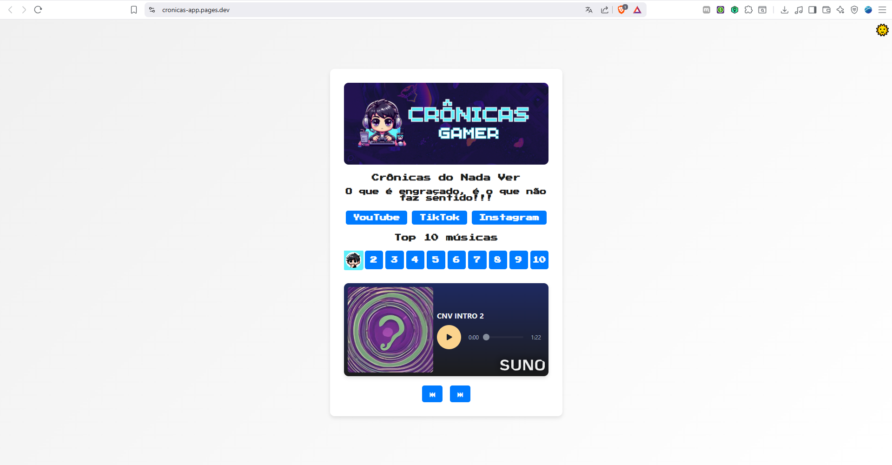

# Documentação do Projeto: Crônicas App

## Descrição do Projeto
O Crônicas App é uma aplicação web que centraliza conteúdos do projeto "Crônicas do Nada Ver". A aplicação exibe informações, links para redes sociais e outros conteúdos relacionados. O projeto utiliza uma arquitetura moderna com integração contínua (CI) e entrega contínua (CD) para garantir qualidade e automação no desenvolvimento e deploy.


---

## Estrutura do Projeto

```
cronicas-app/
├── .eslintignore          # Arquivos ignorados pelo ESLint
├── .eslintrc.json         # Configuração do ESLint
├── .gitignore             # Arquivos ignorados pelo Git
├── Dockerfile             # Configuração para criar a imagem Docker
├── jest.config.js         # Configuração do Jest para testes
├── package.json           # Gerenciamento de dependências e scripts
├── README.md              # Documentação do projeto
├── .github/               # Configurações e automações do GitHub
│   ├── CODEOWNERS         # Define os responsáveis por aprovar PRs
│   ├── actions/           # Ações personalizadas do GitHub
│   │   └── validate-repo/ # Validação da estrutura do repositório
│   └── workflows/         # Workflows de CI/CD
│       ├── ci-actions.yml # Workflow para validar e buildar ações
│       └── ci-cd.yml      # Workflow principal de CI/CD
├── src/                   # Código-fonte da aplicação
│   ├── app.js             # Lógica principal da aplicação
│   ├── server.js          # Configuração do servidor
│   └── public/            # Arquivos públicos (HTML, CSS)
│       ├── index.html     # Página inicial
│       └── styles.css      # Estilos da aplicação
├── test/                  # Testes automatizados
│   └── app.test.js        # Testes unitários/integrados
└── coverage/              # Relatórios de cobertura de testes
    └── lcov-report/       # Relatórios HTML detalhados
```

---

## Fluxo de Trabalho (CI/CD)

### 1. Integração Contínua (CI)
O workflow de CI é definido no arquivo `ci-cd.yml` e executa as seguintes etapas:

- **Checkout do Código**: Faz o download do código do repositório.
- **Setup do Ambiente**: Configura o Node.js (versão 20) e instala dependências.
- **Validação do Repositório**: Usa a action interna `validate-repo` para verificar se os arquivos obrigatórios estão presentes.
- **Linting**: Executa o ESLint para garantir a padronização do código.
- **Testes Automatizados**: Executa os testes com Jest e gera relatórios de cobertura.

### 2. Entrega Contínua (CD)
O workflow de CD realiza o deploy da aplicação na AWS. As etapas incluem:

- **Login no Amazon ECR**: Faz login no repositório de contêineres da AWS.
- **Build e Push da Imagem Docker**: Constrói a imagem Docker da aplicação e envia para o Amazon ECR.
- **Deploy na Instância EC2**: Usa o AWS SSM para:
  - Parar e remover o container existente.
  - Baixar a última imagem Docker.
  - Iniciar um novo container com a aplicação.
- **Notificação de Falha**: Em caso de erro, envia um e-mail para os responsáveis.

### 3. Validação e Build das Actions

O workflow `ci-actions.yml` é responsável por validar e buildar as actions personalizadas do repositório. Ele executa as seguintes etapas:

- **Identificar Actions Alteradas**: Verifica quais diretórios de actions foram modificados.
- **Instalar Dependências**: Instala as dependências de cada action alterada.
- **Executar Linter e Testes**: Garante que o código das actions segue os padrões e está funcionando corretamente.
- **Build das Actions**: Gera os arquivos necessários para execução das actions.
- **Commit e Push**: Atualiza os arquivos de build no repositório.
- **Notificação de Falha**: Em caso de erro, envia um e-mail para os responsáveis.

---

### 4. Criação Automática de Pull Requests

O workflow `create-pr.yml` cria automaticamente pull requests para a branch `main` quando há alterações em branches `feature/*`. Ele executa as seguintes etapas:

- **Checkout do Repositório**: Faz o download do código da branch atual.
- **Criação do Pull Request**: Usa a action `peter-evans/create-pull-request` para criar um PR com título e descrição predefinidos.

---

### 5. Tipos de Commits

Aqui estão 3 padrões de commit que devem ser utilizados com o prefixo cnv-*:

- `cnv-upd`: Commit para atualização de arquivos.
- `cnv-deploy`: Commit para iniciar workflow CI/CD.
- `cnv-docs`: Commit para atualização de documentação.
> `cnv-commit`: Será somente utilizado para quando o commit não conter algum dos 3 anteriores.
## Como Executar Localmente

### Pré-requisitos
- Node.js (>= 16)
- Instância EC2
- Docker instalado na EC2
- AWS CLI configurado na EC2
- Repositório no ECR
- Git

### Passos

1. **Clone o Repositório**:

   ```bash
   git clone https://github.com/masneto/cronicas-app.git
   cd cronicas-app
   ```

2. **Instale as Dependências**:

   ```bash
   npm install
   ```

3. **Execute a Aplicação**:

   ```bash
   npm start
   ```

4. **Acesse no Navegador**:

   Acesse [http://localhost:3000](http://localhost:3000).

---

## Como Executar os Testes

1. **Executar Testes da Aplicação**:

   ```bash
   npm test
   ```

2. **Executar Testes das Actions**:

   ```bash
   cd .github/actions/NAME
   npm test
   ```

3. **Gerar Relatório de Cobertura**:

   Após os testes, o relatório estará disponível no diretório `coverage/lcov-report/index.html`.

---

## Deploy Manual

1. **Build da Imagem Docker**:

   ```bash
   docker build -t cronicas-app .
   ```

2. **Executar o Container**:

   ```bash
   docker run -d -p 3000:3000 --name cronicas-app cronicas-app
   ```

3. **Acesse a Aplicação Local**:

   Acesse [http://localhost:3000](http://localhost:3000).

---

## Responsáveis por Aprovações
Somente os usuários abaixo podem aprovar pull requests para Main e o Deploy em Produção:

- @masneto
- @nettoops

---

## Tecnologias Utilizadas
- Node.js: Backend da aplicação.
- Express: Framework para o servidor.
- Docker: Contêinerização da aplicação.
- AWS (ECR, EC2, SSM): Infraestrutura de deploy.
- GitHub Actions: Automação de CI/CD.
- Jest: Testes automatizados.
- ESLint: Padronização de código.

---

## Melhorias Futuras
1. **Adicionar Monitoramento**: Integrar ferramentas como CloudWatch ou Prometheus para monitorar a aplicação.
2. **Expandir Testes**: Adicionar testes de integração e end-to-end.
3. **Documentação Avançada**: Criar uma documentação detalhada para desenvolvedores e usuários finais.
4. **Criação de Fluxos**: Criar workflows que entreguem em etapas anteriores a produção, permitindo a realização de testes necessários para os desenvolvedores conseguirem subir com qualidade e segurança.
5. **Observabilidade e Monitoramento**: Implementar ferramentas como Grafana e Prometheus, Datadog para a observabilidade e monitoramento da aplicação.
6. **Gerenciamento via Kubernetes**: Gerenciar a imagem via Kubernetes garantindo a escabilidade e segurança da aplicação dentro da EC2.